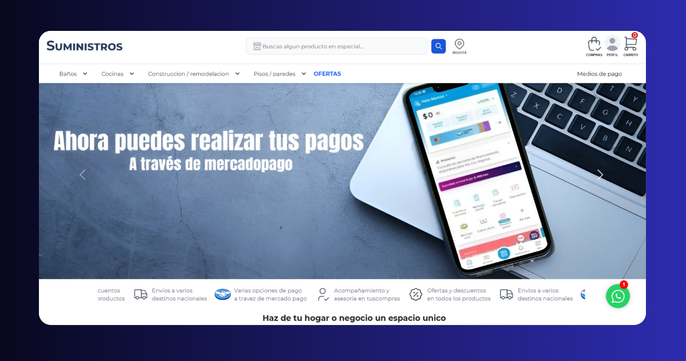

move# Proyecto de Tienda Web - Suministros

<a href="https://suministros-app-alpha.vercel.app/">



</a>
Este es un proyecto de tienda en línea desarrollado con Astro y react, que permite a los usuarios realizar compras, gestionar su perfil y realizar pagos a través de la pasarela de Mercado Pago.

## Índice

- [Características](#características)
- [Tecnologías](#tecnologías)
- [Requisitos Previos](#requisitos-previos)
- [Instalación](#instalación)
- [Configuración](#configuración)
- [Estructura del Proyecto](#estructura-del-proyecto)
- [Licencia](#licencia)

## Características

- _Pasarela de pagos con Mercado Pago_: Integración completa para procesar pagos de manera segura.
- _Autenticacion con google con el protocolo Auth_: Integración completa para la autenticacion con google de manera segura.
- _Gestión de perfiles de usuario_: Permite a los usuarios registrarse, iniciar sesión y gestionar su perfil.
- _Experiencia de compra_: Funcionalidad de carrito de compras, navegación de productos por categorías y opciones de filtrado.
- _Interfaz amigable_: Desarrollada con Astro y Tailwind CSS para una experiencia de usuario óptima en dispositivos móviles y de escritorio.

## Tecnologías

- _Frontend_: [Astro](https://astro.build/) con componentes React y Tailwind CSS.
- _Autenticación_: Gestionada mediante JWT para asegurar las sesiones de usuario.
- _Pasarela de Pago_: [Mercado Pago](https://www.mercadopago.com/) para la integración de pagos en línea.

## Requisitos Previos

Antes de comenzar, asegúrate de tener instalado lo siguiente:

- [Astro](https://astro.build/) (para ejecutar el proyecto)
- [Node.js](https://nodejs.org/) (versión 14 o superior)
- Cuenta de [Mercado Pago](https://www.mercadopago.com/)
- Cuenta de [Google Cloud](https://cloud.google.com/cloud-console/)

## Instalación

1. Bifucar o Clonar el repositorio\*:

```text
 git clone https://github.com/cdomdev/suministros-app
```

2. Instalar las dependencias:

Usamos npm para instalar y administrar las dependencias.

# Instala node para Windows:

- powershell -c https://nodejs.org/dist/v20.18.0/node-v20.18.0-x64.msi | bash

# Instalacion con npm:

```text
- npm install
```

## Configuracion

1. _Configurar el entorno_:

Crea un archivo .env en la raiz del proyecto y añade las siguientes varibles con tus claves de acceso

Cliente de google para inicio de sesion - lo solicitas atrevez de: https://developers.google.com/identity/oauth2/web/guides/get-google-api-clientid

```text
PUBLIC_CLIENT_ID='Tu cliente_ID'
```

Cliente de mercadopago para procesar pagos - lo solicitas atrevez de: https://www.mercadopago.com.co/developers/es/docs/checkout-api

```text
PUBLIC_CLIENT_MERCADOPAGO='Tu cliente mercado pago'
```
Cliente de ipInfo para el manejo de ubicacion aproximada de usuarios - lo solicitas atrevez de: https://ipinfo.io/


```text
PUBLIC_TOKEN_IPINFO="Tu token"
```
Para el manejo de ruta de compras y pago a traves de el modo contra entrega con el rol de usuario

```text
PUBLIC_URL_CLIENT="buy-user"
```


Para el manejo de ruta de compras y pago a traves de mercadopago con el rol de usuario 
```text
PUBLIC_URL_CLIENT_MERCADOPAGO="mercadopago-user"
```


## Estructura del Proyecto


```text
/
├── public/
│   └── favicon.webp
├── src/
│   ├── components /
│   │   └── CardProducts.astro
│   ├── content/
│   │   └── Content.ts
│   ├── events/
│   │   └── Content.ts
│   ├── hook/
│   │   └── Content.ts
│   ├── layouts/
│   │   └── Layout.astro
│   └── services/
│       ├──  Layout.astro
│       ├──  Layout.astro
│       └── Layout.astro
└── .astro.c
├── .gitignore
└── .env
└── package.json
└── README.md

```

## Licencia

Este proyecto está bajo la Licencia MIT - Para mas detalles ver el archivo LICENSE.
